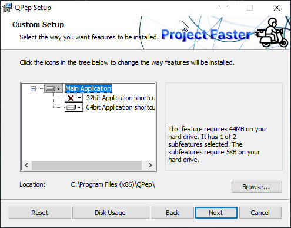
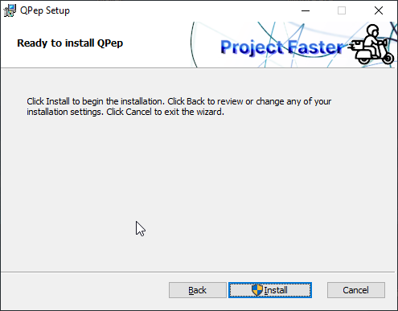

User Manual
======


Introduction
------

The name **_QPep_** stands for "___**Q**uic **P**erformance **E**nhancing **P**roxy___", it is part of the [Project-Faster](https://docs.projectfaster.org/) initiative and its primary
goals are to:

* Enhance the performance of TCP connections over high latency networks (eg. satellite connections)

* Improve the user experience when network are facing disruption

* Provide a platform to experiment and compare the various QUIC implementations available against a common scenario

\bigskip

The acceleration of the TCP connections is accomplished on the client side by redirecting, with following methods, those connections that would have normally be sent over the high latency network:

1. WinDivert Driver (*Windows Only*)

2. IPtables redirect (*Linux Only*)

3. Local Proxy

\bigskip

The methods do seamlessly bridge, in the form of QUIC streams, the TCP connections originated on the local machine through to a QUIC tunnel which is received on the server machine.

\bigskip

Once this stream is received on the server, a connection to the original destination of the TCP connection is opened and the request is executed and the data exchanged as if the tunnel was not there at all.

The following image exposes schematically the architecture for QPep:

{ width=350pt }

\bigskip

In which we can see the main components of a QPep service setup:

- In green, the client side, in which the QPep client redirects the user TCP connections (eg. used by browser and email
  software) to the QUIC tunnel

- In the middle, the satellite (or other high latency network) which just relays the UDP packets back and forth

- In red, the server side, in which the QPep server receives the QUIC streams and opens the original TCP connections to
  the internet

\bigskip

The benefits of using the QUIC protocol over UDP are too numerous to list here, so we'll just indicate the most important ones:

* **_Resiliency to loss, corruption and duplication of data_** without having to rely on costly, in terms of round-trip time, acknowledgment packets for every data packet sent

* **_Speed-up of the initial handshake process_** by simplifying the process of establishing secure connections by unifying the usual TCP and TLS handshake process into a single packets exchange

* **_Adaptability to differing MTU conditions_** as the QUIC packets are usually sent to the MTU size of the
  connection and is automatically adapted if sent packets are detected as lost

\newpage

QPep supports different backend implementations of the QUIC protocol currently:

* _[Quicly](https://github.com/h2o/quicly)_ : Through the [Quicly-Go](https://github.com/Project-Faster/quicly-go) wrapper, which supports the new SEARCH CCA slowstart implementation

* _[Quic-Go](https://github.com/quic-go/quic-go)_ : An implementation of QUIC in pure Go

More integrations are planned for future versions.

\bigbreak

Minimum Requirements
------

The following are the minimum requirements to execute the QPep software:

* ***Windows 11/10/8 x64***

* ***Linux Ubuntu 22.04 or newer***

At least 8GB RAM and a Satellite network connection are recommended but not required.

\newpage

Installation
------

### Download

Refer to https://github.com/Project-Faster/qpep/releases to download the latest release specific for your system environment.

### Windows

> Before proceding be sure to have Administrator rights for your local machine

Once obtained the install.msi file, open it and you'll be greeted by the intro screen:

{ width=300pt }

\newpage

Selecting "Next" will bring to the Licence Acceptance screen, please read the licence carefully and
when ready please select the "___I accept the terms in the License Agreement___".

If necessary print the License and select the "Next" button to proceed and accept the License.

{ width=250pt }

The third screen will allow to select the destination directory of installation and the components to install,
if no special need is required than accept the default configuration by clicking "Next".

{ width=250pt }

\newpage

Last screen is the final confirmation before the actual installation begins, if not already done at the start,
here the "Install" button will require to elevate the process to Administrator rights.

{ width=300pt }

Once terminated an icon will be able to be found on the user's desktop that allows to launch the
QPep tray application:

{ width=100pt }

\newpage

### Linux

> Before proceding be sure to have Administrator rights for your local machine

Once obtained, copy the QPep binary in the directory ```/opt/qpep``` which should be writable
by the user that will run qpep executable.

To allow it to run, execute the following command:
```chmod +x ./qpep```

At this point the executable can be launched in one of two ways:

- Standalone mode

- Service mode

\bigbreak

If using Standalone mode, simply ```cd``` to the installation directory and run: ```./qpep```, this will
launch the executable directory and it will be stopped by signal or CTRL-C combination.

Use ```-h``` switch for additional flags that can be used in this mode.

\bigbreak

If using Service mode, ```cd``` to the installation directory and use the following commands to manage the installation of the service:

* '`./qpep --service install`' 
  ~ to install the service, fails if already installed (Requires root priviledges)

* '`./qpep --service uninstall`' 
  ~ to remove the service, it should be stopped first (Requires root priviledges)

\bigbreak

The execution in this mode can be checked by monitoring the ***qpep-service.log*** and ***qpep-server.log*** files that
are created in the installation directory.

#### Notes on redirection

On Linux platform, setting the `prefer_proxy: true` parameter has no effect as only the iptables diverter is usable dynamically.

\newpage

### MacOS

> Before proceding be sure to have Administrator rights for your local machine
> and that MacOS version is at least MacOS X 10.13 Ventura or later

To begin the installation process, open the provided _QPepInstaller.pkg_ file.

{ width=250pt }

\bigbreak

On next screen press 'Next' to accept the software license.

{ width=250pt }

Next step allows to select, if possible, the destination folder and drive.

{ width=250pt }

\bigbreak

After this the installation proceeds automatically and if successful, a confirmation message is displayed.

{ width=250pt }

\bigbreak

Later the QPep application can be found in the 'Application' folder of the system and on the
main menu.

{ width=250pt }

Usage of the application is the same as indicated for the other platforms.

#### Uninstallation
If you wish to remove QPep from you MacOS system, you can use the provided _QPepUninstaller.pkg_ file as
the standard remove operation from Application folder does not remove the qpep services.

\newpage

Configuration files
------

In this section the configuration files used by QPep are described, they are found in the "config" subdirectory 
after launching qpep service first time.

### File qpep.yml and qpep.user.yml

Following is an example of a complete configuration file and then a description of all the parameters available:

- **qpep.yml** : Main configuration file, if not present on startup a default one is produced

```
client:
  local_address: 0.0.0.0
  local_port: 9443
  gateway_address: 192.18.0.254
  gateway_port: 443

server:
  local_address: 192.168.1.54
  local_port: 443

protocol:
  backend: quic-go
  buffersize: 512
  idletimeout: 30s
  ccalgorithm: cubic
  ccslowstart: search

security:
  certificate: server_cert.pem
  private_key: server_key.pem # empty for client

general:
  max_retries: 50
  diverter_threads: 4
  use_multistream: true
  prefer_proxy: true
  api_port: 444
  verbose: false

analytics:
  enabled: false
  address: 127.0.0.1
  port: 8080
  protocol: tcp
  topic: data-topic

limits:
  ignored_ports:
    - 3389      # example exclude RDP in TCP mode
  incoming:
    - 192.168.1.100: 100K
  outgoing:
    - wikipedia.org: 500K

debug:
  dump_packets: false
  mask_redirect: false
```

Any of the sections can be missing, in that case the default values are used.

- **qpep.user.yml** : File has the same format and values as qpep.yml but when values are present those take precedence over the ones in qpep.yml

### Parameters

#### Client

Allows to customize the behavior when in client mode.

* **local_address** : Private listening address on which the local proxy host is set

* **local_port** : Private listening address on which the local proxy port is set

* **gateway_address** : Remote address of the server on which the QUIC tunnel is sent

* **gateway_port** : Remote port of the server on which the QUIC tunnel is sent

#### Server

Allows to customize the behavior when in server mode.

* **local_address** : Public listening address on which the server receives quic connections

* **local_port** : Public listening address on which the server receives quic connections

\newpage


#### Protocol

Internal options for the QUIC backends.

* **backend** : Selects the QUIC backend to use to handle the connections, available 'quic-go' and 'quicly-go'

* **buffersize** : Size of the receive / send buffer for TCP <-> QUIC connections, default `512`

* **idletimeout** : Timeout to wait before closing an hanged connection, default `30s`

* **ccalgorithm** : Congestion control algorithm to use, accepted values are 'reno'(default), 'cubic' and 'pico' (parameter
  only supported by the 'quicly-go' backend)

* **ccslowstart** : Slowstart phase algorithm to use, accepted values are 'search'(default), 'rfc2001', 'none' (parameter only supported by the 'quicly-go' backend)


#### Security

Options for the encryption to be used.

* **certificate** : PEM file with the public certificate of the remote server

* **private_key** : PEM file with the private key associated to the public certificate selected (only required in server mode)


#### General

Miscellaneous options about the behavior of the QPep software.

* **max_retries** : Maximum number of failed attempts at connection before automatically stopping client, default `50`

* **diverter_threads** : Internal number of threads to handle the diverted packets, default `4`

* **use_multistream** : If true instructs the selected backend to try to reuse the connection with additional streams, default `true`

* **prefer_proxy** : Prefers proxy diverter instead of installing WinDivert driver, default `true`

* **api_port** : Port on which the REST API server listens for requests, default `444`

* **verbose** : Enables verbose logging, default `false`


#### Analytics

Parameters used to configure the support for sending performance statistics to mqtt broker.

* **enabled** : Enables the connection and sending of events to mqtt broker

* **address** : Address of the mqtt broker to send events

* **port** : Port of the mqtt broker to send events

* **protocol** : Protocol used to connect to the broker (eg. tcp)

* **topic** : Topic on which to publish the performance events


#### Limits

Allows to set limits for incoming and outgoing connections.

* **ignored_ports** : List of ports to ignore in redirection (implicitly contains port 53 for DNS)

* **incoming** : Map composed by key / value pairs where the key is the address of the incoming connection and the value is the bytes per second specification (eg. 100K)

* **outgoing** : Map composed by key / value pairs where the key is the hostname of the outgoing connection and the value is the bytes per second specification (eg. 100K)


#### Debug

Internal options used for debug purposes, do not use.

Usage
------

### Client

After installing successfully, use the desktop icon to launch the QPep tray application.

{ width=100pt }

A new tray icon will appear:

{ width=100pt }

By right-clicking on the icon itself a menù will appear with a series of options:

{ width=100pt }

The options are currently:

* **About** : Will generate a notification that displays the installed QPep version
* **Status Interface** : Will open in the browser the web status interface, only available if connected
* **Edit Configuration** : Will open the configuration file in the default text editor
* **Reload Configuration** : If connected will restart the client with the updated configuration
* **Listen address** : Will open a sub-menu where the local network address can be selected (normally QPep will try to autodetect but this allows to force the IP used)
* **Activate Client** : Runs the client service
* **Activate Server** : Runs the server service (if configured manually)
* **Quit** : Stops the running service and closes the app


Using the "Activate" options will allow to start the connection, during the tunnel establishment process
the tray icon will blink in this fashion:

{ width=100pt }

Once the connection is opened, the icon will become green and the menu will change in the following way:

{ width=100pt }

Using the "Stop Client" or "Stop Server" options will terminate the connection and return the system to 
the initial configuration.

### Server

> The following instructions apply to Linux OS installation

The following commands can be used to control the run state of the service:

* '`./qpep`' 
  ~ to run the service (in standalone mode), use CTRL-C or a unix signal to terminate it

* '`./qpep --service stop`'
  ~ to stop the service (in service mode)

* '`./qpep --service start`'
  ~ to start the service (in service mode)

* '`./qpep --service status`' 
  ~ to check the current status of the service

\newpage


Example Setup
======

Environment
------

Assume we have the following setup:

{ width=300pt }

From left to right:

* Client PC with local IP address 192.168.1.10

* The Satellite connection

* NAT router which exposes the public address 89.60.20.30

* The Server with private address 172.15.1.10

Based on these parameters we can draft the two configurations for the client and the server.


Client configuration
------

A possible configuration file `qpep.yml` for the client would be:

```
client:
  local_address: 192.168.1.10
  local_port: 9443
  gateway_address: 89.60.20.30
  gateway_port: 443

protocol:
  backend: quic-go
  buffersize: 512
  idletimeout: 30s
  ccalgorithm: cubic
  ccslowstart: search

security:
  certificate: server_cert.pem

general:
  max_retries: 50
  diverter_threads: 4
  use_multistream: true
  prefer_proxy: true
  api_port: 444
  verbose: false
```

Server configuration
------

A potential `qpep.yml` file for the server would be similar to this one:

```
server:
  local_address: 172.15.1.10
  local_port: 443

protocol:
  backend: quic-go
  buffersize: 512
  idletimeout: 30s
  ccalgorithm: cubic
  ccslowstart: search

security:
  certificate: server_cert.pem
  private_key: server_key.pem

general:
  max_retries: 50
  diverter_threads: 4
  use_multistream: true
  prefer_proxy: true
  api_port: 444
  verbose: false
```

Important details
------

Notice also a couple of important details for a correct configuration:

* The `backend` value must be the same for both sides as the backend are not interoperable 
and will fail connection.

* The `api_port` value must be the same or the client will not be able to obtain the data to deduce
that it actually is connected to the server.

* The file pointed at by `certificate` parameter must be the same on both ends, as otherwise the encryption
will differ and the two services will not be able to communicate properly.

* The values for `client.gateway_port` and `server.local_port` have to be the same for communication
to happen properly, also this port is the only one that must be opened in the server firewall.
